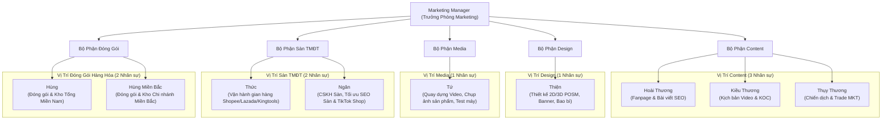

# SƠ ĐỒ TỔ CHỨC (ORG CHART) PHÒNG MARKETING - KING BLUE

Tài liệu chuẩn hóa cơ cấu tổ chức, phân công nhiệm vụ và ánh xạ tài khoản phân quyền người dùng (User CRM/Task) cho Phòng Marketing thương hiệu **King Blue**.

---

## 1. Sơ Đồ Cấu Trúc Nhân Sự (Visual Org Chart)

---

## 2. Phân Công Trách Nhiệm Chi Tiết (RACI & Job Matrix)

| Nhóm chức năng | Nhân sự | Vai trò & Trách nhiệm chính | Sản phẩm đầu ra (Deliverables) |
| :--- | :--- | :--- | :--- |
| **Content Marketing** | **Hoài Thương** | - Quản trị nội dung Fanpage Facebook King Blue Tools. - Viết bài tin tức, cẩm nang cơ khí, bài chuẩn SEO cho website `kingblue.vn`. | - 3 - 4 bài viết/tuần trên Fanpage. - Bài viết tin tức kỹ thuật trên web. |
| **Content Marketing** | **Kiều Thương** | - Lên kịch bản video test máy pin, unboxing, mẹo thợ cho YouTube và TikTok. - Soạn kịch bản và liên hệ làm việc với các KOC review đồ nghề. | - Kịch bản quay video chi tiết. - Lời thoại, thông số lực siết, tính năng nổi bật. |
| **Content Marketing** | **Thụy Thương** | - Viết nội dung thông điệp Trade Marketing, catalogue đại lý, tài liệu hội chợ Vietbuild. - Lên ý tưởng các chương trình khuyến mãi, mini-game, tri ân đại lý. | - Nội dung Catalogue, Profile công ty. - Kế hoạch & thể lệ minigame. |
| **Graphic Design** | **Thiện** | - Phụ trách toàn bộ thiết kế hình ảnh 2D, đồ họa ấn phẩm và layout 3D quầy kệ POSM. - Thiết kế banner sàn Shopee, poster triển lãm Vietbuild, bao bì thùng đồ nghề, vỉ sản phẩm. | - File thiết kế in ấn (AI, Photoshop). - Banner chuẩn kích thước web/app. |
| **Media / Photo** | **Tứ** | - Chụp ảnh sản phẩm chuyên nghiệp (tách nền, ảnh bối cảnh xưởng thợ, góc chi tiết). - Bấm máy quay video test thực tế động cơ Brushless, thước laser, súng bắn đinh. - Dựng hậu kỳ video ngắn (Reels/TikTok) và video dài YouTube. | - Bộ ảnh sản phẩm nét căng đã retouch. - Video thành phẩm đạt chuẩn Full HD/4K. |
| **Sàn TMĐT** | **Thức** | - Quản trị và tối ưu các gian hàng Shopee Mall, Lazada và website phân phối `kingtools.vn`. - Cài đặt chương trình khuyến mại Mega Sale, Flash Sale, đồng bộ tồn kho. | - Doanh số bán hàng sàn. - Báo cáo lượng truy cập, tỷ lệ chuyển đổi. |
| **Sàn TMĐT** | **Ngân** | - Trực chat tư vấn khách hàng trên sàn, xử lý khiếu nại, đánh giá 5 sao. - Quản lý gian hàng TikTok Shop, hỗ trợ phiên Livestream bán hàng. | - Tỷ lệ phản hồi chat > 95%. - Đơn hàng phát sinh từ TikTok Shop. |
| **Đóng gói & Vận hành** | **Hùng** | - Tiếp nhận đơn hàng xuất bán online & đại lý khu vực Miền Nam. - Đóng gói hàng hóa chống sốc cẩn thận, in phiếu xuất, bàn giao đơn vị vận chuyển. | - Hàng đóng gói đúng quy cách, an toàn. - Bàn giao đúng giờ lấy hàng. |
| **Đóng gói & Vận hành** | **Hùng Miền Bắc** | - Tiếp nhận và đóng gói các đơn hàng thuộc kho trung chuyển Miền Bắc (Hà Nội). - Quản lý lưu kho bao bì, phụ kiện tiêu hao phục vụ thị trường phía Bắc. | - Đơn hàng xuất kho miền Bắc nhanh chóng. - Kiểm kê vật tư đóng gói định kỳ. |

---

## 3. Quy Tắc Phân Quyền Tài Khoản Người Dùng (CRM & Hệ Thống Quản Trị)

Theo chuẩn nghiệp vụ quản trị hệ thống của King Blue:
1. **Admin / Leader**: Cấp phát tài khoản đăng nhập (Username & Password) cho từng nhân sự.
2. **Nhóm Sales & Sàn (Thức, Ngân)**:
   - Quyền hạn: Quản trị đơn hàng, dữ liệu khách hàng lẻ & thông tin hỏi làm đại lý, xem báo cáo doanh thu.
3. **Nhóm Media / Photographer (Tứ)**:
   - Quyền hạn: User tải lên dữ liệu ảnh gốc (Raw), video thành phẩm, cập nhật tiến độ buổi quay chụp vào task dự án.
4. **Nhóm Content & Design (Hoài Thương, Kiều Thương, Thụy Thương, Thiện)**:
   - Quyền hạn: User nhận task giao việc, cập nhật link sản phẩm bàn giao, tải tài liệu duyệt từ Admin.
5. **Nhóm Đóng gói (Hùng, Hùng Miền Bắc)**:
   - Quyền hạn: User xác nhận trạng thái "Đã đóng gói" và "Đã giao vận chuyển" trên hệ thống quản lý đơn.
